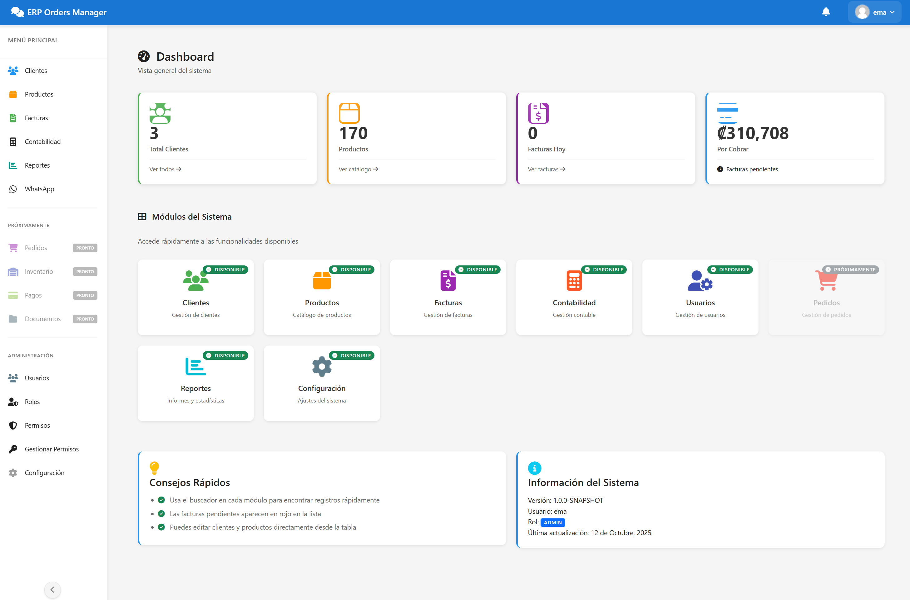
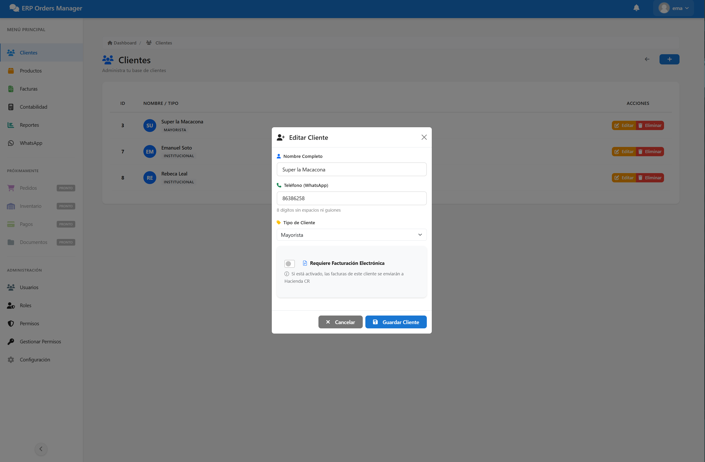
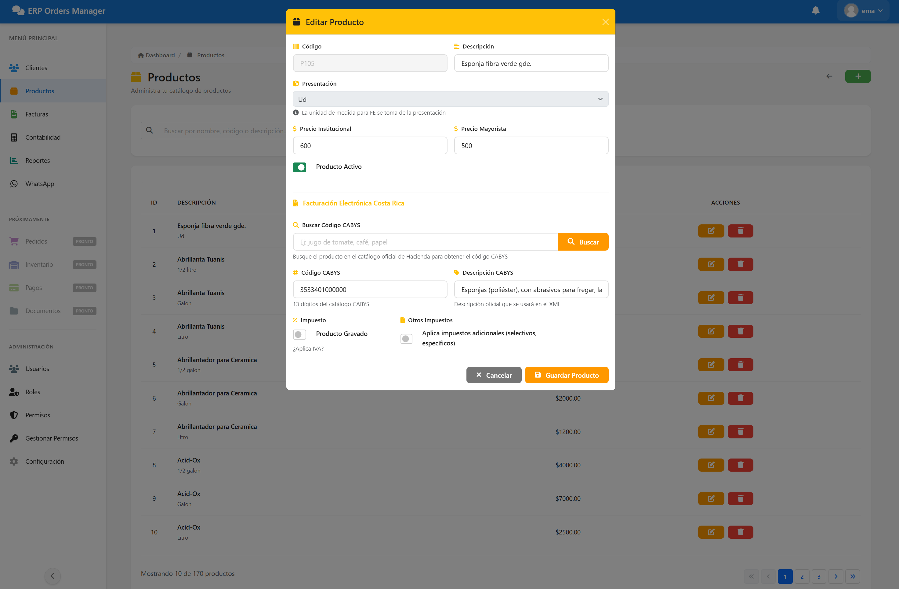
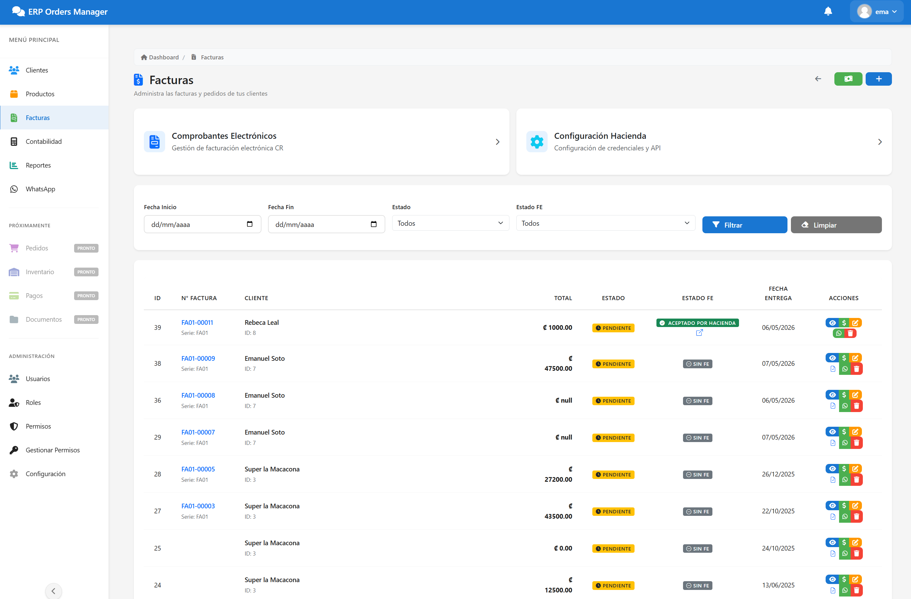
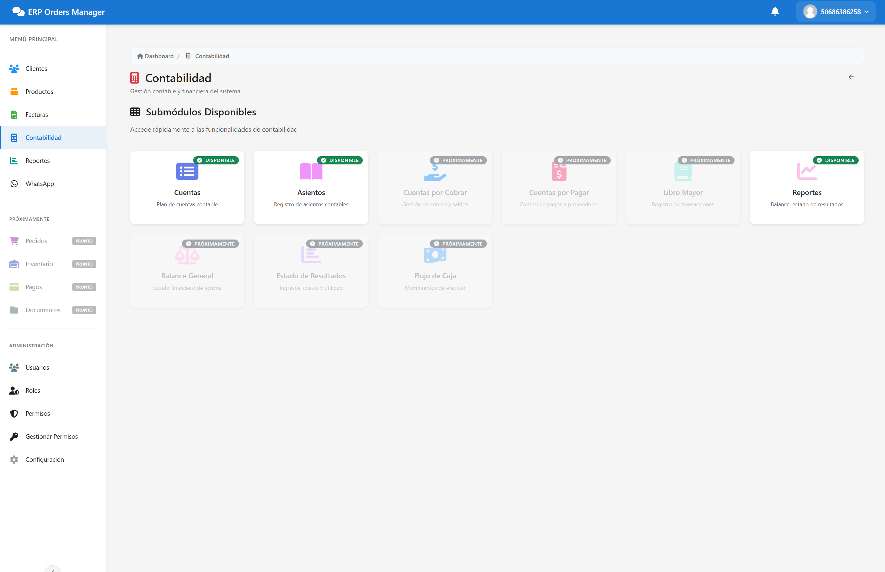
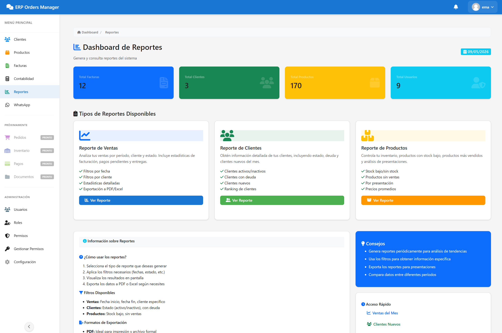
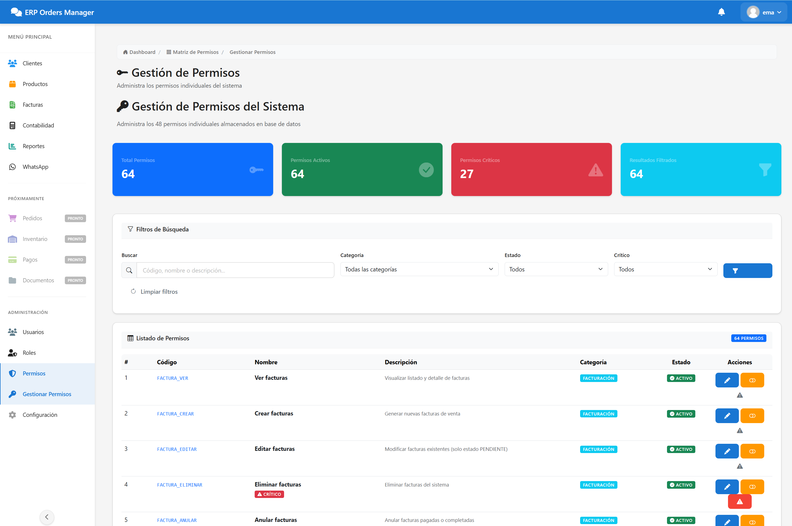
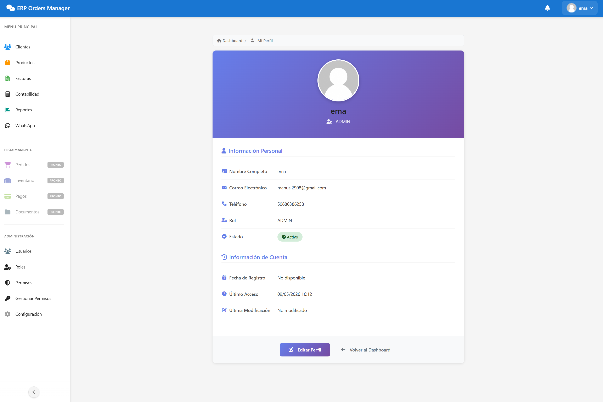

# ERP Orders Manager — ERP

> Sistema ERP para gestión de pedidos, ventas e inventario, con Facturación Electrónica integrada para Costa Rica (CPFE v4.4)

[](https://spring.io/projects/spring-boot)
[](https://www.oracle.com/java/)
[](https://getbootstrap.com/)
[](LICENSE)

---

## Tabla de Contenidos

- [Descripción](#descripción)
- [Capturas de Pantalla](#capturas-de-pantalla)
- [Características](#características)
- [Tecnologías](#tecnologías)
- [Requisitos Previos](#requisitos-previos)
- [Instalación](#instalación)
- [Configuración](#configuración)
- [Facturación Electrónica CR](#facturación-electrónica-cr)
- [Estructura del Proyecto](#estructura-del-proyecto)
- [Roles y Permisos](#roles-y-permisos)
- [Documentación](#documentación)
- [Roadmap](#roadmap)
- [Licencia](#licencia)

---

## Descripción

**ERP Orders Manager** es un sistema ERP orientado a pequeñas y medianas empresas de Costa Rica que gestionan pedidos a través de WhatsApp. Incluye:

- Dashboard con estadísticas en tiempo real
- Gestión completa de clientes, productos y facturas
- **Facturación Electrónica integrada con Hacienda CR** (CPFE v4.4, firma XAdES-BES)
- Sistema de perfiles y roles de usuario
- Diseño 100% responsive (móvil, tablet, desktop)

---

## Capturas de Pantalla

### Dashboard


### Gestión de Clientes


### Gestión de Productos


### Gestión de Facturas


### Gestión Contable


### Reportes


### Gestión de Permisos


### Perfil de Usuario


---

## Características

### Dashboard
- 4 widgets de estadísticas en tiempo real
- Módulos dinámicos según rol de usuario
- Auto-refresh cada 30 segundos

### Gestión de Clientes
- CRUD completo con búsqueda en tiempo real
- Filtros por tipo de cliente
- Validación de datos de ubicación (requerida por Hacienda CR para Receptor en FE)

### Gestión de Productos
- CRUD completo con validaciones
- Precios mayorista e institucional
- Control de stock con alertas
- Códigos únicos generados automáticamente
- Paginación inteligente (sliding window)

### Gestión de Facturas
- Creación y edición con líneas de detalle dinámicas
- Cálculo automático de impuestos y totales
- Filtros por estado y fecha
- Emisión de comprobantes electrónicos directamente desde la vista de factura

### Facturación Electrónica CR
- Generación de XML según esquema CPFE v4.4 de Hacienda CR
- Firma digital XAdES-BES con certificado `.p12`
- Envío asíncrono a la API de Hacienda (sandbox y producción)
- Polling automático del estado (`ind-estado`) con hasta 5 reintentos
- Estados: PENDIENTE → ENVIADO → ACEPTADO / RECHAZADO
- Configuración por empresa (cédula, ambiente, consecutivos)

### Perfil de Usuario
- Edición de datos personales
- Cambio de contraseña con validación
- Upload de avatar (JPG, PNG, GIF)

### Seguridad
- Autenticación con Spring Security 6
- 3 roles: ADMIN, USER, CLIENTE
- Protección CSRF en todos los formularios
- Sesiones limitadas (1 por usuario)
- Registro de último acceso

---

## Tecnologías

### Backend
- **Java 21 LTS**
- **Spring Boot 3.5.0** (MVC, Security, Data JPA, Async)
- **Spring Data JPA / Hibernate 6.6** — ORM
- **MySQL 8.0** — base de datos
- **Maven** — gestor de dependencias
- **Bouncy Castle** — firma digital XAdES-BES para FE CR
- **Caffeine Cache** — caché de configuraciones

### Frontend
- **Thymeleaf 3** — motor de plantillas
- **Bootstrap 5.3** — framework CSS
- **Font Awesome 6.4** — iconos
- **JavaScript ES6+** — lógica cliente
- **SweetAlert2 11** — alertas y notificaciones

### Herramientas
- **Git** — control de versiones
- **MySQL Workbench** — administración de BD
- **IntelliJ IDEA / VS Code** — IDEs recomendados

---

## Requisitos Previos

- Java 21 LTS o superior
- MySQL 8.0 o superior
- Maven 3.6 o superior
- Certificado digital `.p12` emitido por BCCR (para Facturación Electrónica)
- Credenciales de Hacienda CR (client_id y client_secret para el ambiente correspondiente)

---

## Instalación

### 1. Clonar el repositorio

```bash
git clone https://github.com/tu-usuario/whats-orders-manager.git
cd whats-orders-manager
```

### 2. Crear la base de datos

```sql
CREATE DATABASE whatsapp_orders CHARACTER SET utf8mb4 COLLATE utf8mb4_unicode_ci;
```

### 3. Configurar variables de entorno

```bash
# Copiar el template
cp .env.local.template .env.local
# Editar .env.local con tus credenciales reales
```

### 4. Compilar

```bash
mvn clean compile
```

### 5. Ejecutar

```powershell
# PowerShell — carga automáticamente .env.local
.\start.ps1

# O manual
mvn spring-boot:run
```

### 6. Acceder

Abrí el navegador en: **http://localhost:9090**

Credenciales por defecto:
- **Usuario:** `admin`
- **Contraseña:** `admin123`

---

## Configuración

### Variables de entorno principales

```bash
# Base de datos
DB_URL=jdbc:mysql://localhost:3306/whatsapp_orders
DB_USERNAME=tu_usuario
DB_PASSWORD=tu_password

# Puerto
SERVER_PORT=9090

# Perfil de Spring
SPRING_PROFILES_ACTIVE=production
```

### Facturación Electrónica

La configuración de FE se gestiona desde la interfaz en **Configuración → Hacienda**:

| Campo | Descripción |
|-------|-------------|
| Cédula empresa | Número de cédula jurídica o física del emisor |
| Nombre comercial | Nombre que aparece en el comprobante |
| Ambiente | `SANDBOX` (pruebas) o `PRODUCCION` |
| Client ID / Secret | Credenciales OAuth2 de Hacienda CR |
| Certificado `.p12` | Subido vía UI; almacenado cifrado |
| PIN del certificado | PIN del `.p12` para firma XAdES-BES |
| Consecutivos | Generados automáticamente por el sistema |

---

## Facturación Electrónica CR

### Flujo de emisión

```
Factura guardada
      │
      ▼
[Generar XML CPFE v4.4]
      │
      ▼
[Firmar XAdES-BES con .p12]
      │
      ▼
[POST → API Hacienda]  ──► 202 PROCESANDO
      │
      ▼
[Polling cada 30s, máx 5 intentos]
      │
      ├──► ACEPTADO  ✅
      └──► RECHAZADO ✗ (detalle en campo mensajeRespuesta)
```

### Clave numérica (50 dígitos)

```
País(3) + Día(2) + Mes(2) + Año(2) + Cédula(12) + Consecutivo(20) + Situación(1) + Seguridad(8)
```

El `NumeroConsecutivo` en el XML se extrae de `clave.substring(21, 41)` — esto garantiza coherencia con la clave sin depender del campo `consecutivo` almacenado.

### Validaciones Hacienda incluidas

- `OtrasSenas` mínimo 5 caracteres (requerido por XSD UbicacionType)
- Bloque `<Ubicacion>` del Receptor omitido automáticamente si la dirección está incompleta
- `NumeroConsecutivo` extraído de la clave para evitar error `-23`

---

## Estructura del Proyecto

```
whats_orders_manager/
├── src/main/java/api/astro/whats_orders_manager/
│   ├── config/                        # Security, Cache, Async
│   └── modules/
│       ├── cliente/                   # Clientes (CRUD, validaciones FE)
│       ├── producto/                  # Productos e inventario
│       ├── facturacion/
│       │   ├── controller/            # Facturas
│       │   └── electronica/
│       │       ├── controller/        # FE endpoints + vistas
│       │       ├── service/           # Generación XML, firma, envío
│       │       ├── model/             # ComprobanteElectronico, ConfiguracionHacienda
│       │       └── enums/             # EstadoComprobante, AmbienteHacienda
│       ├── configuracion/             # ConfiguracionEmpresa
│       ├── ubicacion/                 # Provincias, cantones, distritos CR
│       └── usuario/                   # Usuarios, perfiles, roles
│
├── src/main/resources/
│   ├── templates/modules/             # Vistas Thymeleaf por módulo
│   ├── static/modules/                # JS y CSS por módulo
│   └── application.yml
│
├── docs/
│   ├── sprints/SPRINT_5/              # Documentación Sprint 5 (FE CR)
│   └── base de datos/                 # Scripts SQL y SPs
│
└── pom.xml
```

---

## Roles y Permisos

| Módulo | ADMIN | USER | CLIENTE |
|--------|:-----:|:----:|:-------:|
| Dashboard | ✅ | ✅ | ❌ |
| Clientes | CRUD | CRUD | ❌ |
| Productos | CRUD | CRUD | ❌ |
| Facturas | CRUD | CR | Solo propias |
| Facturación Electrónica | ✅ | ✅ | ❌ |
| Configuración Empresa / Hacienda | ✅ | ❌ | ❌ |
| Usuarios | CRUD | ❌ | ❌ |
| Perfil propio | ✅ | ✅ | ✅ |

---

## Documentación

La documentación completa está en `/docs/`:

- `docs/sprints/SPRINT_5/` — Sprint 5: Facturación Electrónica CR (completado)
- `docs/base de datos/` — Scripts SQL y stored procedures
- `CHECKLIST_CONFIGURACION.md` — Setup paso a paso
- `INICIO_RAPIDO.md` — Guía rápida de arranque

---

## Roadmap

### Completado
- [x] CRUD Clientes, Productos, Facturas
- [x] Sistema de roles y seguridad
- [x] Facturación Electrónica CR — CPFE v4.4 (sandbox validado)
- [x] Firma XAdES-BES
- [x] Polling de estado con Hacienda CR
- [x] Validaciones XSD completas (OtrasSenas, NumeroConsecutivo)
- [x] Gestión de ubicaciones CR (provincias, cantones, distritos)

### Próximos pasos
- [ ] Migración a ambiente de producción Hacienda CR
- [ ] Job de recuperación automática (`@Scheduled`) para comprobantes ENVIADO sin respuesta
- [ ] Notas de crédito y débito electrónicas
- [ ] Reportes y exportación PDF
- [ ] API REST pública
- [ ] Multi-tenant (múltiples empresas)

---

## Licencia

Este proyecto está bajo la Licencia MIT. Ver archivo `LICENSE` para más detalles.

---

**Autor:** Emanuel Soto Leal  
**Email:** manusl2908@gmail.com  
**Última actualización:** 2026-05-09  
**Versión:** 2.0.0  
**Estado:** Activo — Sprint 5 completado (Facturación Electrónica CR sandbox validada)
