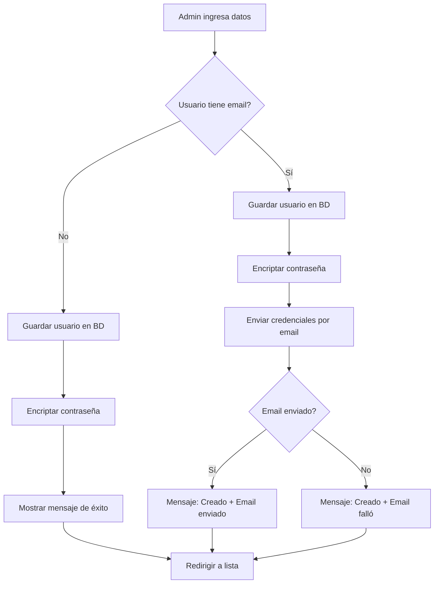
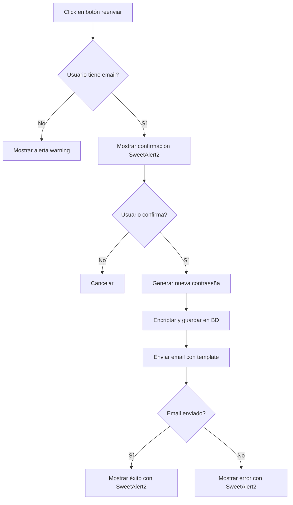

## 🔄 Flujo Completo

### Escenario 1: Crear Nuevo Usuario

```mermaid
graph TD
    A[Admin ingresa datos] --> B{Usuario tiene email?}
    B -->|Sí| C[Guardar usuario en BD]
    B -->|No| D[Guardar usuario en BD]
    C --> E[Encriptar contraseña]
    D --> F[Encriptar contraseña]
    E --> G[Enviar credenciales por email]
    F --> H[Mostrar mensaje de éxito]
    G --> I{Email enviado?}
    I -->|Sí| J[Mensaje: Creado + Email enviado]
    I -->|No| K[Mensaje: Creado + Email falló]
    H --> L[Redirigir a lista]
    J --> L
    K --> L
```

### Escenario 2: Reenviar Credenciales

```mermaid
graph TD
    A[Click en botón reenviar] --> B{Usuario tiene email?}
    B -->|No| C[Mostrar alerta warning]
    B -->|Sí| D[Mostrar confirmación SweetAlert2]
    D --> E{Usuario confirma?}
    E -->|No| F[Cancelar]
    E -->|Sí| G[Generar nueva contraseña]
    G --> H[Encriptar y guardar en BD]
    H --> I[Enviar email con template]
    I --> J{Email enviado?}
    J -->|Sí| K[Mostrar éxito con SweetAlert2]
    J -->|No| L[Mostrar error con SweetAlert2]
```

---

