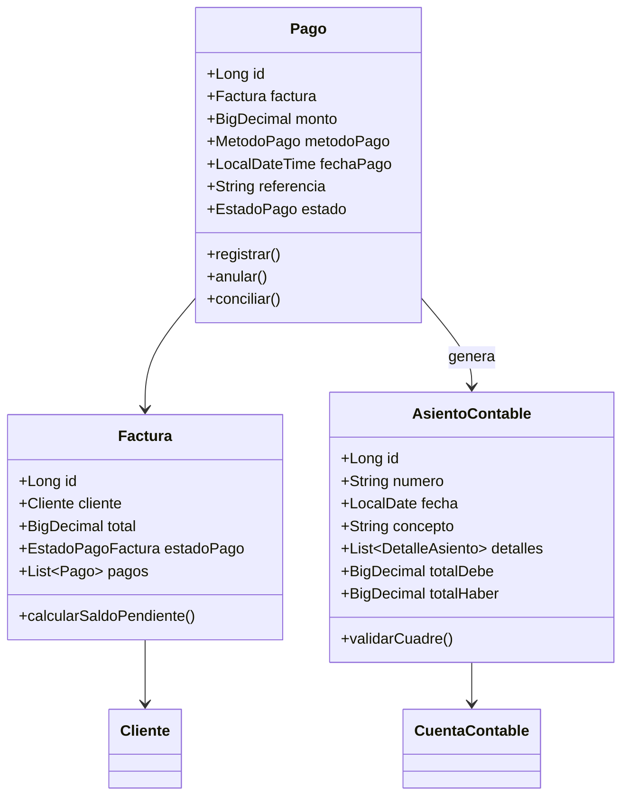
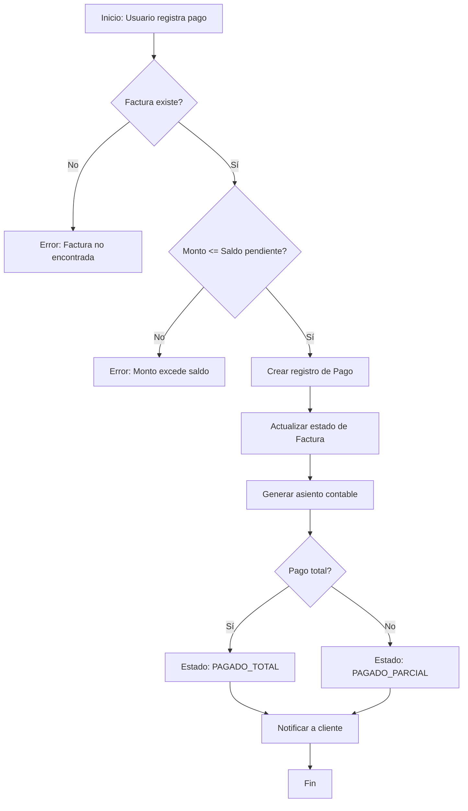

# 📚 FASE 5: Documentación Técnica y de Usuario

**Sprint:** 5  
**Fase:** 5 de 5  
**Duración estimada:** 2-3 días  
**Prioridad:** ⭐ MEDIA  
**Estado:** 📋 PENDIENTE (0/12 tareas)

---

## 📋 OBJETIVO DE LA FASE

Crear documentación completa y profesional para:
- ✅ Usuarios finales (manuales de usuario)
- ✅ Administradores (guías de configuración)
- ✅ Desarrolladores (documentación técnica)
- ✅ Documentación de API REST

---

## 📊 PROGRESO GENERAL

```
Progreso: [0/12] ░░░░░░░░░░░░░░░░░░░░ 0%

├─ 1. Manuales de Usuario       [0/3] ░░░░░░░░░░ 0%
├─ 2. Guías de Configuración    [0/3] ░░░░░░░░░░ 0%
├─ 3. Documentación Técnica     [0/4] ░░░░░░░░░░ 0%
└─ 4. API REST y Swagger        [0/2] ░░░░░░░░░░ 0%
```

---

## 📦 1. MANUALES DE USUARIO (3 tareas)

### 1.1. Manual de Gestión de Pagos

**Archivo:** `docs/manuales/MANUAL_PAGOS.md`

#### Tareas:

- [ ] **1.1.1** Crear manual completo de Pagos (500-700 líneas)

**Contenido:**
- Introducción al módulo de pagos
- Cómo registrar un pago manual
- Métodos de pago disponibles (8 tipos Hacienda)
- Cómo consultar estado de cuenta de cliente
- Cómo conciliar pagos pendientes
- Reportes de pagos
- FAQs y solución de problemas

```markdown
# 💳 Manual de Gestión de Pagos

**Versión:** 1.0  
**Última actualización:** Enero 2026  
**Módulo:** Pagos y Cuentas por Cobrar

---

## 📋 Tabla de Contenidos

1. [Introducción](#introducción)
2. [Registrar un Pago](#registrar-un-pago)
3. [Métodos de Pago](#métodos-de-pago)
4. [Estado de Cuenta de Cliente](#estado-de-cuenta)
5. [Conciliación Bancaria](#conciliación-bancaria)
6. [Reportes de Pagos](#reportes-de-pagos)
7. [Preguntas Frecuentes](#faqs)

---

## 📖 Introducción

El módulo de **Pagos** permite:
- Registrar pagos recibidos de clientes
- Aplicar pagos a facturas pendientes
- Conciliar pagos bancarios
- Generar estado de cuenta de clientes
- Realizar reportes de cobranza

### Permisos requeridos

Para usar este módulo necesita los siguientes permisos:

| Permiso | Descripción |
|---------|-------------|
| `PAGO_CREAR` | Registrar nuevos pagos |
| `PAGO_EDITAR` | Modificar pagos pendientes |
| `PAGO_VER` | Consultar pagos existentes |
| `PAGO_ANULAR` | Anular pagos confirmados |
| `PAGO_CONCILIAR` | Conciliar pagos bancarios |

---

## 💰 Registrar un Pago

### Paso 1: Acceder al módulo

1. Desde el menú principal, ir a **Ventas → Pagos**
2. Hacer clic en el botón **"+ Nuevo Pago"**

### Paso 2: Seleccionar cliente

1. En el campo **Cliente**, escribir el nombre o cédula
2. El sistema autocompletará con clientes existentes
3. Seleccionar el cliente correcto

### Paso 3: Seleccionar factura

1. Se mostrarán todas las facturas pendientes del cliente
2. Seleccionar la factura a pagar
3. El sistema mostrará:
   - **Total factura:** ¢11,300.00
   - **Pagado:** ¢5,000.00
   - **Saldo pendiente:** ¢6,300.00

### Paso 4: Ingresar datos del pago

| Campo | Descripción | Ejemplo |
|-------|-------------|---------|
| **Monto** | Cantidad recibida | ¢6,300.00 |
| **Método de pago** | Ver sección siguiente | Transferencia |
| **Fecha** | Fecha del pago | 15/01/2026 |
| **Referencia** | Número de transacción | TR-123456 |
| **Notas** | Observaciones opcionales | Pago final factura F-001 |

### Paso 5: Confirmar

1. Hacer clic en **"Guardar Pago"**
2. El sistema:
   - Crea el pago en estado **CONFIRMADO**
   - Actualiza el estado de la factura a **PAGADO_TOTAL**
   - Genera asiento contable automático
   - Envía notificación al cliente (si está configurado)

---

## 🏦 Métodos de Pago

El sistema soporta **8 métodos** según catálogo de Hacienda de Costa Rica:

| Código | Método | Cuenta contable | Ejemplo |
|--------|--------|-----------------|---------|
| **01** | Efectivo | 1.1.01.001 - Caja General | Cliente paga en efectivo |
| **02** | Tarjeta | 1.1.01.003 - Datafono | Pago con Visa |
| **03** | Cheque | 1.1.01.004 - Cheques por Depositar | Cheque BCR #123456 |
| **04** | Transferencia | 1.1.01.002 - Banco BAC | SINPE Móvil |
| **05** | Recaudado terceros | 1.1.02.001 - Cuentas por Cobrar | Cobro por distribuidor |
| **06** | Pago electrónico | 1.1.01.002 - Banco | Pago online |
| **07** | Nota de crédito | 1.1.02.002 - Notas de Crédito | Aplicar NC-001 |
| **99** | Otros | Configurable | Otros métodos |

### Importante ⚠️

- **Tarjeta:** Considerar comisión bancaria (2-3%)
- **Cheque:** Verificar que no esté posfechado
- **Transferencia:** Validar comprobante bancario
- **Nota de crédito:** Debe existir NC previa

---

## 📊 Estado de Cuenta de Cliente

### Generar estado de cuenta

1. Ir a **Clientes → Estado de Cuenta**
2. Seleccionar cliente
3. Elegir rango de fechas
4. Hacer clic en **"Generar"**

### Información incluida

El estado de cuenta muestra:

```
ESTADO DE CUENTA - Juan Pérez
Período: 01/01/2026 - 31/01/2026

┌─────────────┬──────────┬───────────┬───────────┬──────────┐
│ Fecha       │ Documento│ Debe      │ Haber     │ Saldo    │
├─────────────┼──────────┼───────────┼───────────┼──────────┤
│ 05/01/2026  │ F-001    │ ¢11,300   │           │ ¢11,300  │
│ 10/01/2026  │ PAG-001  │           │ ¢5,000    │ ¢6,300   │
│ 15/01/2026  │ PAG-002  │           │ ¢6,300    │ ¢0       │
└─────────────┴──────────┴───────────┴───────────┴──────────┘

Total facturado: ¢11,300.00
Total pagado:    ¢11,300.00
Saldo pendiente: ¢0.00
```

### Exportar estado de cuenta

- **PDF:** Enviar por email al cliente
- **Excel:** Para análisis adicional
- **Imprimir:** Para archivo físico

---

## 🔄 Conciliación Bancaria

### ¿Qué es la conciliación?

Proceso de verificar que los pagos registrados coincidan con movimientos bancarios.

### Pasos para conciliar

1. Ir a **Pagos → Conciliación Bancaria**
2. Seleccionar cuenta bancaria
3. Importar extracto bancario (Excel/CSV)
4. El sistema mostrará pagos pendientes de conciliar
5. Hacer match manual o automático
6. Confirmar conciliación

### Estados de conciliación

| Estado | Descripción |
|--------|-------------|
| **PENDIENTE** | Pago registrado, no conciliado |
| **CONCILIADO** | Match con extracto bancario |
| **DISCREPANCIA** | Monto no coincide |

---

## 📈 Reportes de Pagos

### Reporte de cobranza

**Acceso:** Reportes → Cobranza

Muestra:
- Total cobrado por período
- Desglose por método de pago
- Gráfica de tendencia
- Mora promedio

### Reporte de antigüedad de saldos

**Acceso:** Reportes → Antigüedad de Saldos

```
Cliente          │ 0-30 días │ 31-60 días │ 61-90 días │ >90 días │
─────────────────┼───────────┼────────────┼────────────┼──────────┤
Juan Pérez       │ ¢0        │ ¢0         │ ¢5,000     │ ¢0       │
María López      │ ¢10,000   │ ¢0         │ ¢0         │ ¢2,000   │
```

---

## ❓ Preguntas Frecuentes

### ¿Puedo modificar un pago ya confirmado?

No. Los pagos confirmados no se pueden editar. Para corregir, debe:
1. Anular el pago incorrecto
2. Crear un nuevo pago con los datos correctos

### ¿Cómo aplicar un pago a varias facturas?

1. Crear un pago para la primera factura
2. Si sobra dinero, el sistema preguntará si desea aplicarlo a otra factura
3. Seleccionar la siguiente factura y repetir

### ¿Qué pasa si el pago es mayor al saldo?

El sistema no permite registrar pagos mayores al saldo pendiente. Si el cliente pagó de más, considerar:
- Crear una **Nota de Crédito** por el excedente
- Dejar el monto como **Anticipo** para futuras compras

### ¿Cómo anular un pago?

1. Ir a **Pagos → Listado**
2. Buscar el pago a anular
3. Hacer clic en **"Anular"**
4. El sistema:
   - Cambia estado a **ANULADO**
   - Revierte el asiento contable
   - Actualiza estado de la factura
   - Requiere permiso `PAGO_ANULAR`

---

## 📞 Soporte

Para más ayuda, contactar a:
- **Soporte técnico:** soporte@empresa.cr
- **Tel:** 2222-3333
- **WhatsApp:** 8888-7777

---

**Documento creado:** Enero 2026  
**Versión del sistema:** 5.0
```

---

### 1.2. Manual de Contabilidad

**Archivo:** `docs/manuales/MANUAL_CONTABILIDAD.md`

#### Tareas:

- [ ] **1.2.1** Crear manual de Contabilidad (800-1000 líneas)

**Contenido:**
- Introducción a la contabilidad de doble partida
- Plan de cuentas incluido
- Cómo crear asientos manuales
- Asientos automáticos del sistema
- Libro Diario, Libro Mayor, Balance
- Cierre contable mensual
- Reportes financieros

---

### 1.3. Manual de Facturación Electrónica CR

**Archivo:** `docs/manuales/MANUAL_FACTURACION_ELECTRONICA_CR.md`

#### Tareas:

- [ ] **1.3.1** Crear manual de FE Costa Rica (1000-1200 líneas)

**Contenido:**
- ¿Qué es la Factura Electrónica?
- Requisitos legales en Costa Rica
- Cómo obtener certificado digital
- Cómo configurar credenciales ATV
- Proceso de emisión de comprobantes
- Estados de comprobantes (Procesando, Aceptado, Rechazado)
- Cómo reenviar comprobantes rechazados
- Cómo consultar en plataforma ATV
- Mensajes de confirmación de receptor
- Solución de problemas comunes

**Secciones importantes:**

```markdown
## 🔐 Obtener Certificado Digital

### Paso 1: Solicitar en Banco

1. Acudir a sucursal de banco autorizado:
   - BCR
   - BNCR
   - Banco de Costa Rica

2. Solicitar **Certificado de Firma Digital para Personas Jurídicas**

3. Requisitos:
   - Cédula de representante legal
   - Personería jurídica vigente (3 meses)
   - Formulario de solicitud del banco
   - Pago de ¢25,000 - ¢40,000 (varía por banco)

### Paso 2: Instalación

1. Recibirá archivo **.p12** con contraseña
2. En el sistema, ir a **Configuración → Facturación Electrónica**
3. Subir archivo **.p12**
4. Ingresar contraseña del certificado
5. El sistema validará que sea válido

---

## 🌐 Obtener Usuario ATV

### ¿Qué es ATV?

**Administración Tributaria Virtual** es la plataforma de Hacienda para gestionar comprobantes.

### Registro

1. Ingresar a [www.hacienda.go.cr](https://www.hacienda.go.cr)
2. Ir a **Servicios → ATV**
3. Crear usuario con:
   - Usuario: Cédula jurídica
   - Contraseña: Crear contraseña segura
   - PIN: Recibirá por correo

4. Activar usuario ATV

### Configurar en el sistema

1. Ir a **Configuración → Facturación Electrónica**
2. Ingresar:
   - Usuario ATV: 3-101-XXXXXX
   - Contraseña ATV: •••••••
3. Hacer clic en **"Probar Conexión"**
4. Si es exitoso, guardará credenciales cifradas

---

## 📤 Emitir un Comprobante

### Proceso automático

1. Al crear una factura normal, el sistema:
   - Genera XML automáticamente
   - Firma digitalmente el documento
   - Envía a Hacienda
   - Espera respuesta

2. Estados:

   **PROCESANDO** → Enviado, esperando respuesta (1-5 min)  
   **ACEPTADO** → Hacienda aceptó el comprobante  
   **RECHAZADO** → Error en el XML, debe corregir  

### Ver estado de comprobante

1. Ir a **Facturas → Listado**
2. En columna **Estado FE** verá:
   - ✅ Aceptado
   - ⏳ Procesando
   - ❌ Rechazado

3. Hacer clic en el ícono para ver detalles

---

## ⚠️ Solución de Problemas

### Error: "Certificado vencido"

**Causa:** El archivo .p12 expiró (válido 2 años)  
**Solución:** Solicitar renovación en el banco

### Error: "Clave numérica duplicada"

**Causa:** Ya existe comprobante con esa clave  
**Solución:** El sistema auto-corrige, reintente

### Error: "XML no válido"

**Causa:** Datos faltantes o incorrectos  
**Solución:** Revisar que factura tenga:
- Cliente con cédula válida
- Productos con código cabys
- Impuestos correctos

### Error: "Credenciales ATV inválidas"

**Causa:** Usuario/contraseña incorrectos  
**Solución:** Verificar en plataforma ATV que usuario esté activo
```

---

## 📦 2. GUÍAS DE CONFIGURACIÓN (3 tareas)

### 2.1. Guía de Configuración del Sistema

**Archivo:** `docs/guias/GUIA_CONFIGURACION_SISTEMA_SPRINT5.md`

#### Tareas:

- [ ] **2.1.1** Documentar configuración completa

**Contenido:**

```markdown
# ⚙️ Guía de Configuración - Sprint 5

## Variables de Entorno

Agregar al archivo `.env`:

```properties
# === CONTABILIDAD ===
contabilidad.enabled=true
contabilidad.plan-cuentas-default=CR  # Costa Rica
contabilidad.numero-digitos-cuenta=4  # Ej: 1.1.01.0001

# === FACTURACIÓN ELECTRÓNICA ===
fe.enabled=true
fe.ambiente=PRODUCCION  # SANDBOX | PRODUCCION
fe.url-api-hacienda=https://api.hacienda.go.cr/fe/ae
fe.certificado-path=/ruta/certificado.p12
fe.certificado-password=ENC(contraseña_cifrada)
fe.atv-usuario=3-101-XXXXXX
fe.atv-password=ENC(contraseña_cifrada)

# === PAGOS ===
pagos.dias-vencimiento-default=30
pagos.permitir-sobrepagos=false
pagos.conciliacion-automatica=true
```

## Inicialización de Datos

1. **Ejecutar migration de Contabilidad:**

```sql
SOURCE docs/base\ de\ datos/MIGRATION_CONTABILIDAD_SPRINT_5.sql;
```

2. **Cargar Plan de Cuentas:**

```sql
SOURCE docs/base\ de\ datos/PLAN_CUENTAS_COSTA_RICA.sql;
```

3. **Configurar consecutivos:**

```sql
INSERT INTO configuracion_consecutivos (tipo, prefijo, siguiente, longitud)
VALUES 
('ASIENTO', 'ASI', 1, 5),
('PAGO', 'PAG', 1, 5),
('COMPROBANTE_FE', '001-001', 1, 10);
```
```

---

### 2.2. Guía de Configuración de Certificado Digital

**Archivo:** `docs/guias/GUIA_CERTIFICADO_DIGITAL.md`

#### Tareas:

- [ ] **2.2.1** Tutorial paso a paso para certificado

---

### 2.3. Guía de Migración de Datos

**Archivo:** `docs/guias/GUIA_MIGRACION_DATOS_SPRINT5.md`

#### Tareas:

- [ ] **2.3.1** Guía para migrar datos existentes

**Contenido:**
- Cómo migrar facturas antiguas al nuevo sistema
- Cómo importar saldos iniciales de clientes
- Cómo cargar asientos de apertura contable
- Scripts SQL incluidos

---

## 📦 3. DOCUMENTACIÓN TÉCNICA (4 tareas)

### 3.1. JavaDoc

#### Tareas:

- [ ] **3.1.1** Generar JavaDoc completo

```java
/**
 * Servicio para gestión de pagos de facturas.
 * 
 * <p>Este servicio permite:
 * <ul>
 *   <li>Registrar pagos recibidos de clientes</li>
 *   <li>Aplicar pagos a facturas pendientes</li>
 *   <li>Generar asientos contables automáticos</li>
 *   <li>Conciliar pagos bancarios</li>
 * </ul>
 * 
 * @author Equipo de Desarrollo
 * @version 5.0
 * @since Sprint 5
 * @see Pago
 * @see AsientoContableService
 */
@Service
public class PagoServiceImpl implements PagoService {
    
    /**
     * Registra un nuevo pago y actualiza el estado de la factura.
     * 
     * @param pagoDTO DTO con datos del pago
     * @return PagoDTO con el pago creado
     * @throws BusinessException si el monto excede el saldo pendiente
     * @throws EntityNotFoundException si la factura no existe
     */
    @Override
    @Transactional
    public PagoDTO registrarPago(PagoDTO pagoDTO) {
        // ...
    }
}
```

**Comando Maven:**
```bash
mvn javadoc:javadoc
```

**Resultado:** `target/site/apidocs/index.html`

---

### 3.2. Diagrama de Clases

**Archivo:** `docs/diagramas/DIAGRAMA_CLASES_SPRINT5.md`

#### Tareas:

- [ ] **3.2.1** Crear diagramas UML de entidades

**Usar Mermaid:**



---

### 3.3. Documentación de Arquitectura

**Archivo:** `docs/arquitectura/ARQUITECTURA_SPRINT5.md`

#### Tareas:

- [ ] **3.3.1** Documentar decisiones arquitectónicas

**Contenido:**
- Patrón de capas (Controller, Service, Repository)
- Uso de DTOs para transferencia de datos
- Eventos del sistema (ApplicationEvent)
- Transacciones distribuidas (pagos + contabilidad)

---

### 3.4. Diagrama de Flujo de Procesos

**Archivo:** `docs/diagramas/FLUJO_PROCESOS_SPRINT5.md`

#### Tareas:

- [ ] **3.4.1** Crear diagramas de flujo críticos

**Ejemplo: Flujo de Pago**



---

## 📦 4. API REST Y SWAGGER (2 tareas)

### 4.1. Configurar Swagger/OpenAPI

**Archivo:** `pom.xml`

#### Tareas:

- [ ] **4.1.1** Agregar dependencia de Swagger

```xml
<dependency>
    <groupId>org.springdoc</groupId>
    <artifactId>springdoc-openapi-starter-webmvc-ui</artifactId>
    <version>2.2.0</version>
</dependency>
```

**Configuración:**

```java
@Configuration
public class SwaggerConfig {
    
    @Bean
    public OpenAPI customOpenAPI() {
        return new OpenAPI()
            .info(new Info()
                .title("ERP WhatsApp Orders Manager - API")
                .version("5.0")
                .description("API REST para gestión de pagos, contabilidad y facturación electrónica")
                .contact(new Contact()
                    .name("Equipo de Desarrollo")
                    .email("dev@empresa.cr"))
                .license(new License()
                    .name("Propietario")
                    .url("https://empresa.cr")));
    }
}
```

**Acceso:** `http://localhost:8080/swagger-ui/index.html`

---

### 4.2. Documentar Endpoints

#### Tareas:

- [ ] **4.2.1** Agregar anotaciones de Swagger en controladores

```java
@RestController
@RequestMapping("/api/pagos")
@Tag(name = "Pagos", description = "API para gestión de pagos")
public class PagoRestController {
    
    @Operation(
        summary = "Registrar un nuevo pago",
        description = "Crea un pago y lo asocia a una factura. Genera asiento contable automático."
    )
    @ApiResponses({
        @ApiResponse(responseCode = "201", description = "Pago creado exitosamente"),
        @ApiResponse(responseCode = "400", description = "Datos inválidos"),
        @ApiResponse(responseCode = "404", description = "Factura no encontrada")
    })
    @PostMapping
    public ResponseEntity<PagoDTO> registrarPago(
        @Parameter(description = "Datos del pago a registrar", required = true)
        @Valid @RequestBody PagoDTO pagoDTO
    ) {
        PagoDTO resultado = pagoService.registrarPago(pagoDTO);
        return ResponseEntity.status(HttpStatus.CREATED).body(resultado);
    }
    
    @Operation(summary = "Obtener estado de cuenta de cliente")
    @GetMapping("/estado-cuenta/{clienteId}")
    public ResponseEntity<EstadoCuentaDTO> obtenerEstadoCuenta(
        @Parameter(description = "ID del cliente", example = "1")
        @PathVariable Long clienteId,
        
        @Parameter(description = "Fecha desde", example = "2026-01-01")
        @RequestParam LocalDate fechaDesde,
        
        @Parameter(description = "Fecha hasta", example = "2026-01-31")
        @RequestParam LocalDate fechaHasta
    ) {
        EstadoCuentaDTO estado = pagoService.obtenerEstadoCuenta(clienteId, fechaDesde, fechaHasta);
        return ResponseEntity.ok(estado);
    }
}
```

---

## 📊 CRITERIOS DE ACEPTACIÓN

✅ Todos los manuales de usuario creados (Pagos, Contabilidad, FE)  
✅ Guías de configuración completas con ejemplos  
✅ JavaDoc generado para todas las clases públicas  
✅ Swagger UI accesible y funcional  
✅ Diagramas UML actualizados  
✅ Documentación revisada por líder técnico  

---

## 📚 DEPENDENCIAS

**Requiere:**
- ✅ Todas las fases anteriores completadas (1-4)
- ✅ Código funcional y testeado

---

## 🚀 PRÓXIMOS PASOS

Una vez completada esta fase:
1. ✅ **Sprint 5 completado al 100%**
2. 🎯 Revisión final con cliente
3. 🚀 Despliegue a producción
4. 📋 Iniciar **SPRINT 6: Multi-Divisa + Inventario**

---

**Fase creada:** 16 de enero de 2026  
**Responsable:** Equipo de Documentación y Desarrollo
