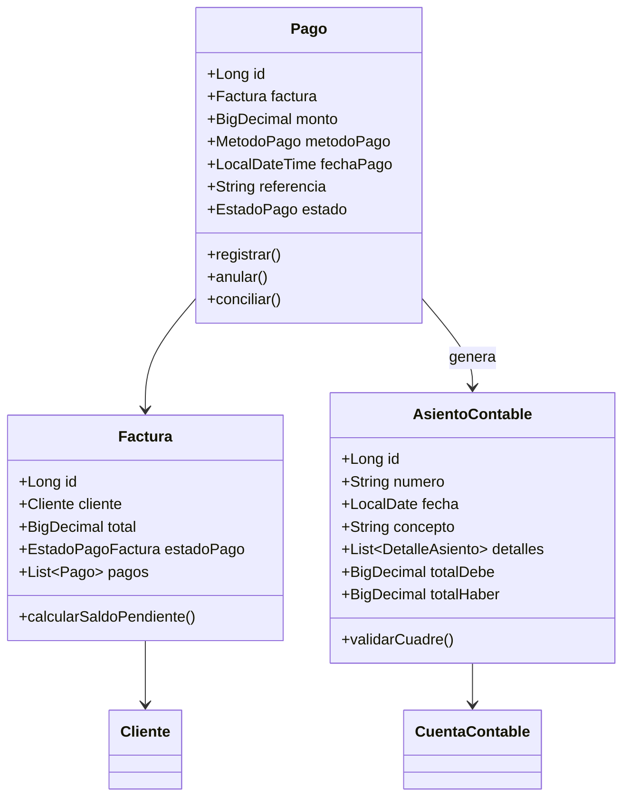
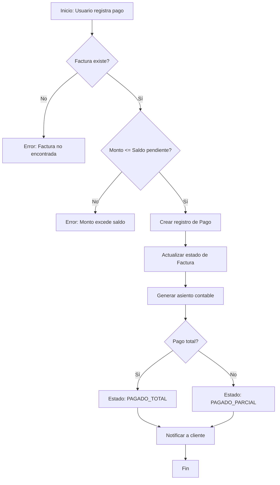

## 📦 3. DOCUMENTACIÓN TÉCNICA (4 tareas)

### 3.1. JavaDoc

#### Tareas:

- [ ] **3.1.1** Generar JavaDoc completo

```java
/**
 * Servicio para gestión de pagos de facturas.
 * 
 * <p>Este servicio permite:
 * <ul>
 *   <li>Registrar pagos recibidos de clientes</li>
 *   <li>Aplicar pagos a facturas pendientes</li>
 *   <li>Generar asientos contables automáticos</li>
 *   <li>Conciliar pagos bancarios</li>
 * </ul>
 * 
 * @author Equipo de Desarrollo
 * @version 5.0
 * @since Sprint 5
 * @see Pago
 * @see AsientoContableService
 */
@Service
public class PagoServiceImpl implements PagoService {
    
    /**
     * Registra un nuevo pago y actualiza el estado de la factura.
     * 
     * @param pagoDTO DTO con datos del pago
     * @return PagoDTO con el pago creado
     * @throws BusinessException si el monto excede el saldo pendiente
     * @throws EntityNotFoundException si la factura no existe
     */
    @Override
    @Transactional
    public PagoDTO registrarPago(PagoDTO pagoDTO) {
        // ...
    }
}
```

**Comando Maven:**
```bash
mvn javadoc:javadoc
```

**Resultado:** `target/site/apidocs/index.html`

---

### 3.2. Diagrama de Clases

**Archivo:** `docs/diagramas/DIAGRAMA_CLASES_SPRINT5.md`

#### Tareas:

- [ ] **3.2.1** Crear diagramas UML de entidades

**Usar Mermaid:**



---

### 3.3. Documentación de Arquitectura

**Archivo:** `docs/arquitectura/ARQUITECTURA_SPRINT5.md`

#### Tareas:

- [ ] **3.3.1** Documentar decisiones arquitectónicas

**Contenido:**
- Patrón de capas (Controller, Service, Repository)
- Uso de DTOs para transferencia de datos
- Eventos del sistema (ApplicationEvent)
- Transacciones distribuidas (pagos + contabilidad)

---

### 3.4. Diagrama de Flujo de Procesos

**Archivo:** `docs/diagramas/FLUJO_PROCESOS_SPRINT5.md`

#### Tareas:

- [ ] **3.4.1** Crear diagramas de flujo críticos

**Ejemplo: Flujo de Pago**



---

